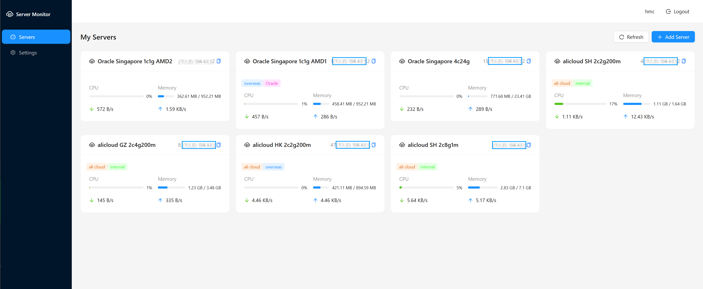
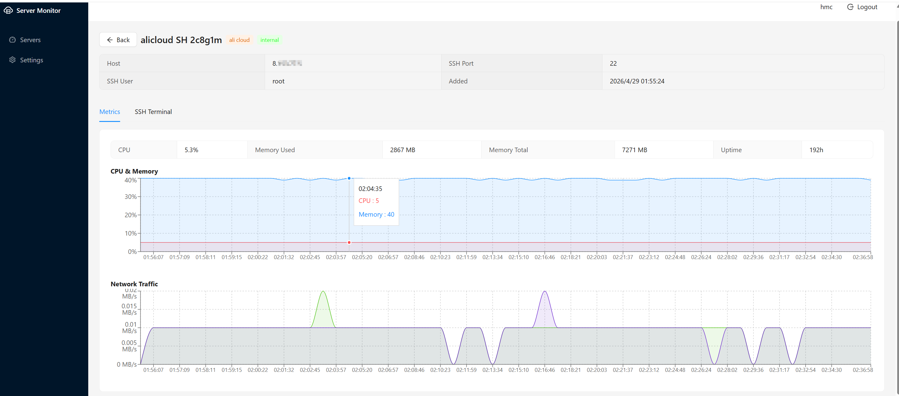
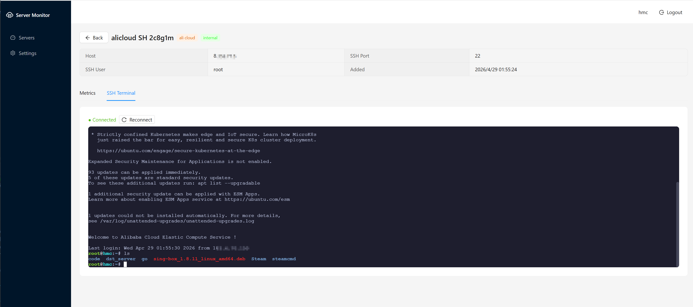

# Server Monitor

[中文](README.md)

Web-based server monitoring platform with real-time SSH terminal.

Built with Claude Code & DeepSeek-v4-pro

---

## Tech Stack

| Layer | Technology |
|---|---|
| Backend | Go + Gin + PostgreSQL |
| Frontend | React 19 + TypeScript + Vite + Ant Design |
| Real-time | WebSocket (SSH Terminal) |
| State Management | Zustand |
| Charts | Recharts |
| Containerization | Docker + Docker Compose |
| CI/CD | GitHub Actions -> GitHub Container Registry |

---

## Security Design

### Password Security

- User passwords are hashed with **bcrypt** (cost factor 12) -- plaintext passwords cannot be recovered even if the database is compromised
- Minimum 6 characters for passwords, 3-64 characters for usernames to prevent weak credentials

### SSH Credential Encryption

- All SSH passwords and keys are encrypted with **AES-256-GCM** before being written to the database
- The encryption key is stored separately from the database (injected via the `ENCRYPTION_KEY` environment variable) -- credentials cannot be decrypted even if the database is leaked
- AES-256-GCM provides authenticated encryption, ensuring both confidentiality and integrity

### Authentication & Authorization

- Stateless authentication based on **JWT (HS256)** with a 72-hour token expiry
- All API requests are authenticated via Bearer Token; WebSocket connections use Query Token
- All data queries are strictly filtered by `user_id` -- **complete data isolation between users** with no cross-tenant access

### API Protection

- Login and registration endpoints are protected by **token bucket rate limiting** (5 requests/min/IP) to prevent brute-force attacks and abuse
- Request parameters are automatically validated via struct binding to prevent malformed input
- Configurable CORS whitelist to restrict cross-origin request sources

### Transport Security

- TLS/HTTPS support (configurable certificate and private key files)
- HTTPS via reverse proxy (Nginx) is recommended for production

### Deployment Security

- Docker images are based on **minimal Alpine Linux builds** to reduce the attack surface
- Sensitive configuration (database credentials, JWT secret, encryption key) is managed via **GitHub Secrets**, never committed to code
- Database uses `ON DELETE CASCADE` foreign key constraints to ensure data consistency

---

## Quick Start

```bash
# Backend
cd backend
cp .env.example .env   # edit with your config
go run ./cmd/server

# Frontend
cd frontend
npm install && npm run dev
```

---

## Deployment

The project uses GitHub Actions to automatically build Docker images and deploy to the server. Push to the `main` branch or manually trigger the workflow.

### Prerequisites

- Server with Docker and Docker Compose installed
- PostgreSQL database configured
- Domain name resolved to the server IP

### Configure GitHub Secrets

Add the following secrets in **Settings -> Secrets and variables -> actions**:

| Secret | Description | Example |
|---|---|---|
| `DEPLOY_HOST` | Server IP or domain | `1.2.3.4` |
| `DEPLOY_USER` | SSH login username | `root` |
| `DEPLOY_PASSWORD` | SSH login password | - |
| `POSTGRES_HOST` | PostgreSQL host | `127.0.0.1` |
| `POSTGRES_PORT` | PostgreSQL port | `5432` |
| `POSTGRES_USER` | PostgreSQL username | `postgres` |
| `POSTGRES_PASSWORD` | PostgreSQL password | - |
| `POSTGRES_DB` | Database name | `svrmonitor` |
| `JWT_SECRET` | JWT signing secret (random string) | `openssl rand -hex 32` |
| `ENCRYPTION_KEY` | SSH credential encryption key (32 bytes) | `openssl rand -hex 16` |
| `DOMAIN` | Website domain name | `svr.hmchxd.com` |

> `GITHUB_TOKEN` is automatically provided by GitHub -- no manual configuration needed.

---

## Screenshots

| Dashboard |
|:---:|
|  |

| Server Detail | SSH Terminal |
|:---:|:---:|
|  |  |

---

## TODO

- [x] **CI/CD Integration** -- GitHub Actions auto lint / build / test / deploy
- [x] **Edit Server Info** -- Support editing host / port / SSH credentials for existing servers
- [x] **Login History** -- Show last login IP, time, and location as a notification after login
- [x] **Docker Management** -- View Docker container list and status on server detail page
- [x] **SSH Key Management** -- Manage SSH keys independently (create, name, associate with servers)
- [x] **SSH Credential Management** -- Manage reusable SSH usernames and passwords
- [ ] **Account Settings** -- Allow users to change passwords and manage account security
- [ ] **Server Groups** -- Create server groups, filter and batch-operate by group
- [ ] **Process List** -- Show current processes on detail page, sortable by CPU / Memory / Name / PID
- [x] **Disk Usage** -- Show current disk usage on detail page
- [ ] **Alert Notifications** -- Push notifications via email or Bark when a server goes offline or CPU exceeds 80%
- [ ] **Probe API** -- Provide probe API or web page similar to https://dt.quwa.cc/ for account-level monitoring
