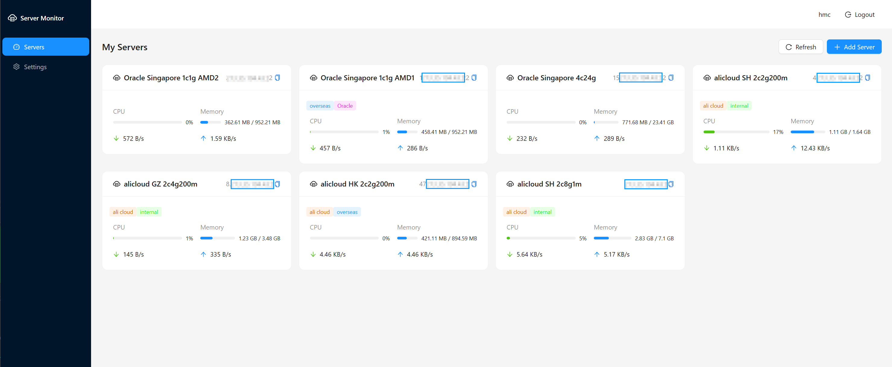
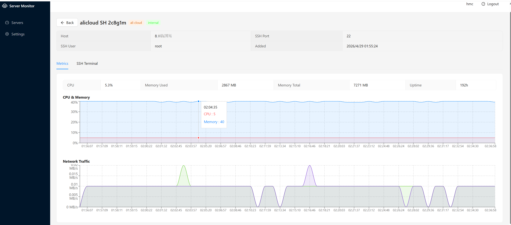
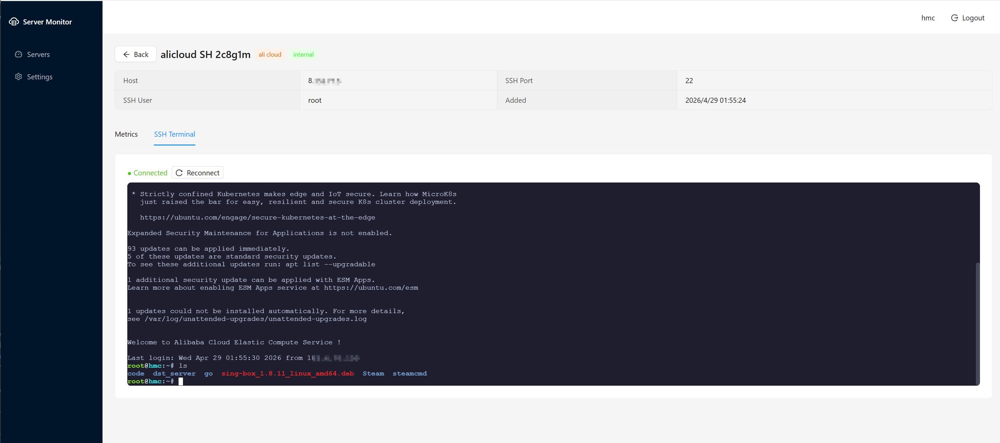

# Server Monitor

[中文](README.md)

Web-based server monitoring platform with real-time SSH terminal.

Built with Claude Code & DeepSeek-v4-pro

---

## Live Site

- 🌐 [Public Probe / Service Status](http://svr.hmchxd.com/status)

The public probe refreshes every 15 seconds and exposes only anonymous node aliases, availability, and rounded CPU, memory, and uptime metrics. It does not return real server names, IP addresses / hostnames, ports, SSH users, credentials, notes, or database IDs.

> **Security note:** Management features handle login tokens and SSH credentials. Use them only after the domain has a valid HTTPS certificate and HTTP is forcibly redirected to HTTPS. The link above points only to the anonymous public status page.

---

## Tech Stack

| Layer | Technology |
|---|---|
| Backend | Go + Gin + PostgreSQL |
| Frontend | React 19 + TypeScript + Vite + Ant Design |
| Real-time | WebSocket (SSH Terminal) |
| State Management | Zustand |
| Charts | Recharts |
| Containerization | Docker + Docker Compose |
| CI/CD | GitHub Actions -> GitHub Container Registry |

---

## Features

| Area | Capabilities |
|---|---|
| Server dashboard | Card / list views (choice remembered), search, filter by tag and online state, sort by CPU / memory / disk / uptime / expiry |
| Overview stats | Total, online / offline, average CPU and memory, monthly-normalized and currency-converted spend |
| Server detail | Resource stat tiles; six charts (CPU / memory / network / disk I/O / load / latency) with adaptive units and theme-aware styling; range presets plus custom windows; CSV export of the charted window |
| Alert center | Threshold rules and an alert timeline, with webhook delivery and a built-in connectivity test |
| Batch operations | Multi-select servers to add/remove tags, delete, export an inventory CSV, or run one command across up to 50 hosts with per-host results |
| Process management | Live process table on the detail page, sortable by PID / user / CPU / memory / RSS / uptime, with search, pausable auto-refresh, and terminate (SIGTERM / SIGKILL) |
| Availability | Observed availability over 24h / 7d / 30d, a 30-day daily strip and outage log, a fleet-wide mean on the overview, and a 30-day SLA figure on the public status page |
| Operations | Web SSH terminal, Docker container management (start / stop / logs / interactive shell), shared SSH credential store, per-server notes |
| Account security | Change your password and sign every other device out at once |
| Public status page | Anonymized probe page whose API excludes identity and connection details at the query level |

### Alerting

Rules are evaluated by a dedicated backend loop (every 30s by default, `ALERT_INTERVAL`) that reads only the latest samples already in the database -- it never opens extra connections to monitored hosts.

- **Metrics**: CPU, memory and disk usage (%), 1-minute load, network latency (ms), and host offline.
- **Sustained duration**: a threshold must hold for the configured window before an alert opens, so transient spikes don't page you. Offline rules never fire sooner than 2 minutes, matching the dashboard's online window.
- **Scope**: target one server, or leave it empty to cover every server you own, including ones added later.
- **Notifications**: a JSON payload is POSTed to the configured webhook on both firing and recovery (see [API.md](API.md)); "Send test" verifies the endpoint before you save.
- **Durable state**: active alerts live in the database, so a restart neither re-notifies nor loses a pending recovery. If a host disappears for good, threshold alerts resolve instead of hanging open forever.

### Availability

Availability is **observed**: the share of expected metric samples that actually landed in the database. It measures "could we see this host", not the host's own uptime counter -- if the panel or its database was down, that stretch counts against every server. The UI states this basis rather than implying otherwise.

- **Three windows**: 24h and 7d read the one-minute rollup; 30d reads the fifteen-minute one (the minute tier only retains 30 days, and scanning it per server is roughly 20x the index work for precision that is invisible at a month's scale).
- **New hosts are not blamed for their own absence**: each window's start is clamped to the server's creation time, and the UI says the measured span is shorter than the label. A window that has not yet covered a whole bucket shows an em dash rather than 0%.
- **No permanent one-bucket deficit**: each window ends on its tier's bucket boundary. The bucket still being filled has not been rolled up yet, and counting it as expected would keep every healthy host just below 100% forever.
- **Daily strip**: 30 days, colour-coded, counted from the same tier as the 30-day figure beside it so the two agree. A fully-down day produces no rows at all and is filled in explicitly instead of vanishing from the chart. Bars are fixed height and carry their value in colour alone -- scaling by availability would make a 0% day a zero-height, i.e. invisible, bar. Days before the server existed are hatched, which must not look like "down all day".
- **Outage log**: derived from gaps of more than two minutes between consecutive buckets, capped at the 50 most recent, with an unrecovered one flagged as ongoing. A host that has never reported shows "no history yet" rather than "no outages" -- there is no sample to anchor an outage to.

---

### Batch operations

Enter multi-select from the dashboard toolbar; both the card and list views become selectable and an action bar slides up.

- **Bulk tags / delete / inventory export**: adding tags is idempotent; deleting cascades to metric history, alert events and tag links; the exported inventory contains no secrets (the API never returns them).
- **Bulk command execution**: up to 50 hosts, 8 at a time, 60s and 64 KB per host. The confirmation dialog lists the exact command and every target; commands must be a single line, and patterns like `rm -rf`, `reboot` or writing to a block device raise an extra warning.
- Each host reports its own exit status and combined output (stdout + stderr) — **one failure does not stop the rest**. Commands run as the configured SSH user with no privilege escalation.

---

## Security Design

### Password Security

- User passwords are hashed with **bcrypt** (cost factor 12) -- plaintext passwords cannot be recovered even if the database is compromised
- Minimum 6 characters for passwords, 3-64 characters for usernames to prevent weak credentials

### SSH Credential Encryption

- All SSH passwords and keys are encrypted with **AES-256-GCM** before being written to the database
- The encryption key is stored separately from the database (injected via the `ENCRYPTION_KEY` environment variable) -- credentials cannot be decrypted even if the database is leaked
- AES-256-GCM provides authenticated encryption, ensuring both confidentiality and integrity

### Authentication & Authorization

- Stateless authentication based on **JWT (HS256)** with a 72-hour token expiry
- **Changing a password immediately revokes every token issued to that account beforehand**: the user row carries a cutoff timestamp and authentication rejects any token with an earlier `iat`. The session that made the change receives a freshly issued token, so it is not cut off by its own action
- All API requests are authenticated via Bearer Token; WebSocket connections use Query Token
- All protected management API queries are strictly filtered by `user_id` for tenant isolation; the public probe uses a separate minimal data model that returns anonymous health metrics only

### API Protection

- Login and registration endpoints are protected by **token bucket rate limiting** (5 requests/min/IP) to prevent brute-force attacks and abuse
- Request parameters are automatically validated via struct binding to prevent malformed input
- Configurable CORS whitelist to restrict cross-origin request sources
- Alert webhooks **reject private targets by default**: URLs resolving to loopback / RFC1918 / link-local / CGNAT addresses are refused at save time and redirects are never followed, so the alerting pipeline can't be used as an SSRF probe into the server's private network (opt out with `ALLOW_PRIVATE_WEBHOOKS=true`). The webhook self-test endpoint is additionally rate limited to 6 requests/min/IP

### Transport Security

- TLS/HTTPS support (configurable certificate and private key files)
- HTTPS via reverse proxy (Nginx) is recommended for production

### Deployment Security

- Docker images are based on **minimal Alpine Linux builds** to reduce the attack surface
- Sensitive configuration (database credentials, JWT secret, encryption key) is managed via **GitHub Secrets**, never committed to code
- Database uses `ON DELETE CASCADE` foreign key constraints to ensure data consistency

---

## Quick Start

```bash
# Backend
cd backend
cp .env.example .env   # edit with your config
go run ./cmd/server

# Frontend
cd frontend
npm install && npm run dev
```

---

## Deployment

The project uses GitHub Actions to automatically build Docker images and deploy to the server. Push to the `main` branch or manually trigger the workflow.

### Prerequisites

- Server with Docker and Docker Compose installed
- PostgreSQL database configured
- Domain name resolved to the server IP

### Configure GitHub Secrets

Add the following secrets in **Settings -> Secrets and variables -> actions**:

| Secret | Description | Example |
|---|---|---|
| `DEPLOY_HOST` | Server IP or domain | `1.2.3.4` |
| `DEPLOY_USER` | SSH login username | `root` |
| `DEPLOY_PASSWORD` | SSH login password | - |
| `POSTGRES_HOST` | PostgreSQL host | `127.0.0.1` |
| `POSTGRES_PORT` | PostgreSQL port | `5432` |
| `POSTGRES_USER` | PostgreSQL username | `postgres` |
| `POSTGRES_PASSWORD` | PostgreSQL password | - |
| `POSTGRES_DB` | Database name | `svrmonitor` |
| `JWT_SECRET` | JWT signing secret (random string) | `openssl rand -hex 32` |
| `ENCRYPTION_KEY` | SSH credential encryption key (32 bytes) | `openssl rand -hex 16` |
| `DOMAIN` | Website domain name | `svr.hmchxd.com` |
| `GHCR_PAT` | GitHub personal access token (read:packages scope) | See note below |

> `GITHUB_TOKEN` is automatically provided by GitHub -- no manual configuration needed.
>
> **GHCR_PAT note**: The deploy server needs to pull private images from GitHub Container Registry. Create a Personal Access Token (classic) at [GitHub Settings → Tokens](https://github.com/settings/tokens) with `read:packages` scope, and add the generated token to this secret.

---

## Screenshots

| Dashboard |
|:---:|
|  |

| Server Detail | SSH Terminal |
|:---:|:---:|
|  |  |

---

## TODO

- [x] **CI/CD Integration** -- GitHub Actions auto lint / build / test / deploy
- [x] **Edit Server Info** -- Support editing host / port / SSH credentials for existing servers
- [x] **Login History** -- Show last login IP, time, and location as a notification after login
- [x] **Docker Management** -- View Docker container list and status on server detail page
- [x] **SSH Key Management** -- Manage SSH keys independently (create, name, associate with servers)
- [x] **SSH Credential Management** -- Manage reusable SSH usernames and passwords
- [x] **Account Settings** -- Change your password from Settings; other sessions are revoked immediately
- [x] **Server Groups / Batch Operations** -- Tags already cover grouping, so this landed as batch actions: bulk tagging, bulk delete, bulk command execution, inventory export
- [x] **Availability Stats** -- Observed 24h / 7d / 30d availability, daily strip and outage log, see below
- [x] **Process List** -- Live process table on the detail page, sortable by CPU / memory / PID / uptime, with search and terminate
- [x] **Disk Usage** -- Show current disk usage on detail page
- [x] **Alert Notifications** -- Threshold rules (CPU / memory / disk / load / latency / offline) with webhook delivery, see below
- [x] **Public Probe** -- Anonymous public status page and minimal status API with server identity and connection details removed
